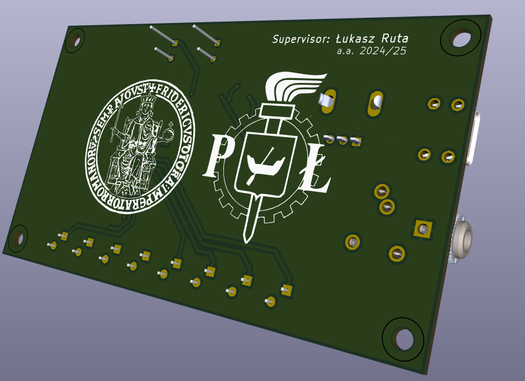

# LED VU Meter – PCB Design Project

## Objective
This project involves the design, simulation, and prototyping of a 8-segment LED VU (Volume Unit) Meter for audio level indication. Developed as part of a university exam project at Politechnika Łódzka (Lodz University of Technology) within the MSc Double Degree in Electronic Engineering.

---

## Features
- Based on **LM3914** LED driver for linear analog signal indication
- Audio signal input via **3.5mm jack (J1)**, with amplification and conditioning
- **Dual Op-Amp LM358** for pre-processing the signal
- Adjustable luminous intensity via **potentiometer TS53YL502**
- 8 LED outputs (D1–D8) showing amplitude levels in real time
- Designed with **KiCad 9.0**, validated with **LTspice** simulations

---

## Tools Used
- **KiCad 9.0** – Schematic & PCB Layout
- **LTspice** – Signal conditioning and stage simulation
- **Excel** – Bill of Materials (BOM)
- **3D Rendering** – KiCad native viewer

---

## Preview

---

## Files Included
- `Schematic_VUMeter_258703.pdf` – Full circuit schematic
- `BOM_VUMeter.xlsx` – Complete list of components
- `PCB_VUMeter_Top_Bottom.pdf` – Layer views

---

## Learning Outcomes
- Multi-stage analog design and filtering
- Signal visualization using driver ICs
- PCB layout design with grounding and routing considerations
- BOM management for real-world prototyping

---

## ✅ Final Assembly & Testing

The VU Meter project has been successfully completed through all design and testing phases.

### 🛠 Key Milestones:
- PCB printed and assembled using Sn96.5/Ag3.0/Cu0.5 solder paste and a hot air rework station (BST-863)
- Full component soldering completed manually
- Output visualised through 8-segment LED scale driven by LM3914

### 📸 Final Result:

### 📄 Report:
Download the complete final project report here:  
[📥 VU_Meter_Project_Report_STROCCHIA.pdf](./VU_Meter_Project_Report_STROCCHIA.pdf)

---

## Author
Raffaele Strocchia – MSc Electronic Engineering  
Double Degree: Università di Napoli Federico II / Politechnika Łódzka  
Year: 2025
